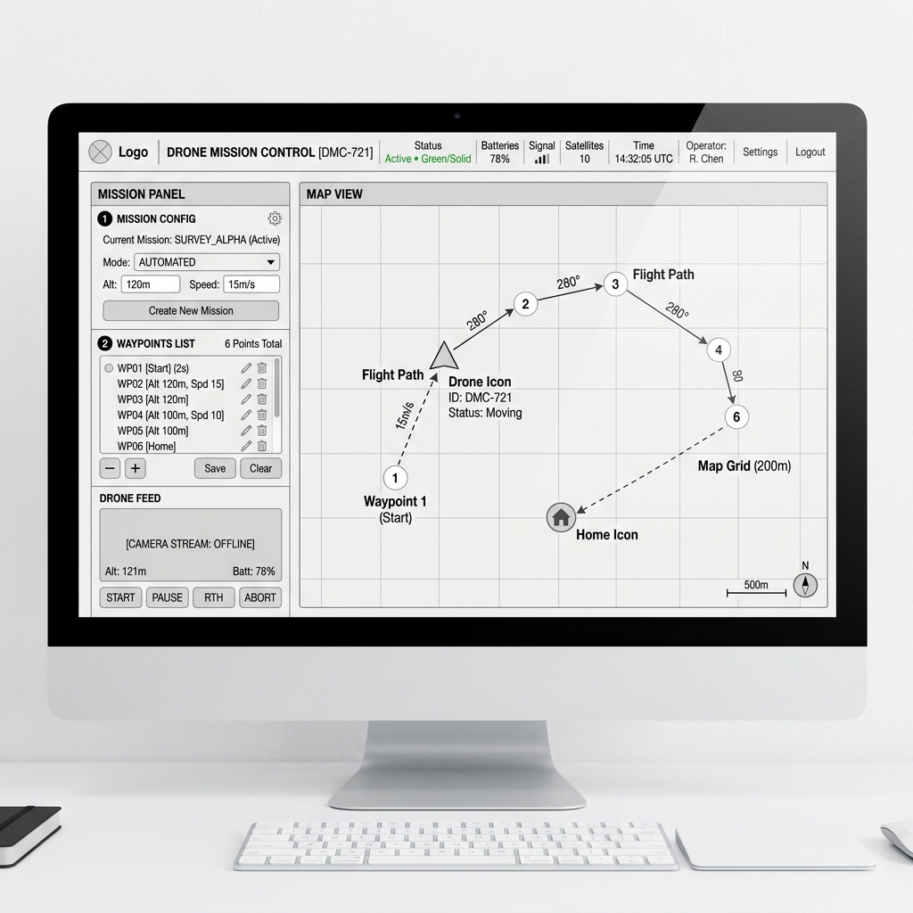

# Giao diện Mission (Wireframe)

Dưới đây là thiết kế Mockup/Wireframe chi tiết cho màn hình **Mission Dashboard**.

## Các thành phần chính:
1. **Bản đồ trung tâm (Map View):**
   - Hiển thị vị trí thực tế của thiết bị (Drone/UAV/Robot).
   - Hiển thị đường bay (Flight Path) và các tọa độ (Waypoints).
   
2. **Bảng điều khiển bên trái (Sidebar):**
   - **Mission Config:** Các cài đặt cơ bản như chế độ bay, độ cao, tốc độ.
   - **Waypoints List:** Danh sách các điểm cần đến (có thể thêm, xóa, sửa).
   - **Drone Feed:** Khung hiển thị camera hoặc trạng thái kết nối trực tiếp.
   - **Các nút điều khiển:** Start, Pause, Return to Home (RTH), Abort.

3. **Thanh trạng thái phía trên (Top Bar):**
   - Hiển thị tình trạng hiện tại (Active/Standby).
   - Mức pin (Batteries), Tín hiệu kết nối (Signal), Số lượng vệ tinh (Satellites).
   - Thời gian và thông tin người vận hành.
