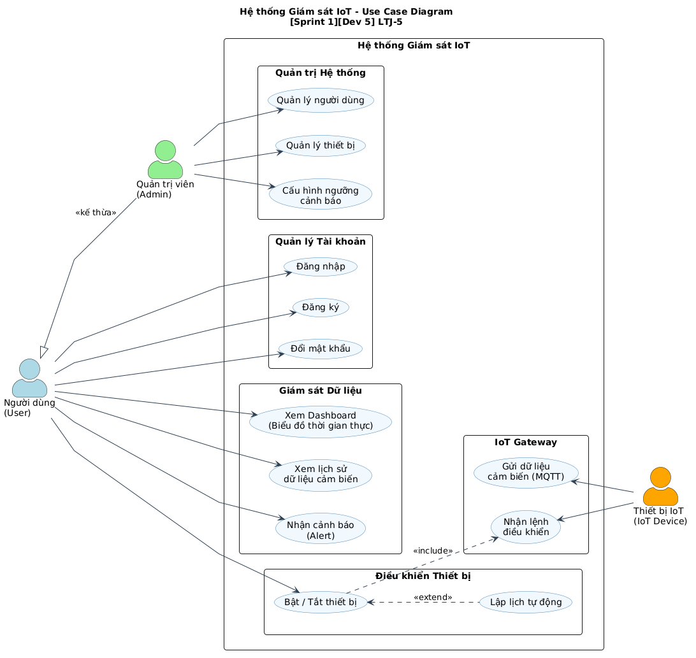

# Use Case Diagram - Hệ thống Giám sát IoT

**Dự án:** Lập Trình Java  
**Task:** [Sprint 1][Dev 5] LTJ-5  
**Ngày tạo:** 09/10/2026  

---

## 1. Danh sách Tác nhân (Actors)

| # | Actor | Mô tả |
|---|-------|-------|
| 1 | **Người dùng (User)** | Người sử dụng hệ thống để giám sát và điều khiển thiết bị IoT |
| 2 | **Quản trị viên (Admin)** | Quản lý người dùng, thiết bị và cấu hình hệ thống |
| 3 | **Thiết bị IoT (IoT Device)** | Cảm biến / thiết bị gửi dữ liệu và nhận lệnh điều khiển |

---

## 2. Danh sách Use Case

### 2.1. Quản lý Tài khoản
| Mã | Use Case | Actor | Mô tả |
|----|----------|-------|-------|
| UC-01 | Đăng nhập | User, Admin | Xác thực tài khoản để truy cập hệ thống |
| UC-02 | Đăng ký | User | Tạo tài khoản mới |
| UC-03 | Đổi mật khẩu | User | Thay đổi mật khẩu cá nhân |

### 2.2. Giám sát Dữ liệu
| Mã | Use Case | Actor | Mô tả |
|----|----------|-------|-------|
| UC-04 | Xem Dashboard | User | Xem biểu đồ thông số (nhiệt độ, độ ẩm, ánh sáng) theo thời gian thực |
| UC-05 | Xem lịch sử dữ liệu | User | Tra cứu dữ liệu cảm biến trong quá khứ |
| UC-06 | Nhận cảnh báo | User | Nhận thông báo khi thông số vượt ngưỡng cho phép |

### 2.3. Điều khiển Thiết bị
| Mã | Use Case | Actor | Mô tả |
|----|----------|-------|-------|
| UC-07 | Bật / Tắt thiết bị | User | Điều khiển bật/tắt thiết bị IoT từ xa |
| UC-08 | Lập lịch tự động | User | Thiết lập lịch trình tự động bật/tắt thiết bị |

### 2.4. Quản trị Hệ thống
| Mã | Use Case | Actor | Mô tả |
|----|----------|-------|-------|
| UC-09 | Quản lý người dùng | Admin | CRUD tài khoản người dùng |
| UC-10 | Quản lý thiết bị | Admin | Thêm, sửa, xóa thiết bị IoT trong hệ thống |
| UC-11 | Cấu hình ngưỡng cảnh báo | Admin | Thiết lập giá trị ngưỡng để kích hoạt cảnh báo |

### 2.5. IoT Gateway
| Mã | Use Case | Actor | Mô tả |
|----|----------|-------|-------|
| UC-12 | Gửi dữ liệu cảm biến | IoT Device | Gửi bản tin JSON qua giao thức MQTT |
| UC-13 | Nhận lệnh điều khiển | IoT Device | Nhận và thực thi lệnh từ hệ thống |

---

## 3. Quan hệ giữa các Use Case và Actor

| Quan hệ | Từ | Đến | Loại | Mô tả |
|---------|-----|------|------|-------|
| Phân cấp vai trò | Quản trị viên (Admin) | Người dùng (User) | `<<kế thừa>>` | Admin kế thừa toàn bộ quyền của User |
| Lập lịch mở rộng từ Bật/Tắt | UC-08 | UC-07 | `<<extend>>` | Tính năng lập lịch tự động mở rộng từ điều khiển Bật/Tắt |
| Bật/Tắt điều khiển thiết bị | UC-07 | UC-13 | `<<include>>` | Khi User bật/tắt sẽ gửi và thiết bị IoT nhận lệnh điều khiển |

---

## 4. Sơ đồ (PlantUML & Hình ảnh)

> - **Mã nguồn PlantUML:** [`docs/UseCase.puml`](./UseCase.puml)
> - **Ảnh vector độ nét cao:** [`docs/images/UseCase.svg`](./images/UseCase.svg)

---

## 5. Ghi chú

- Sơ đồ này bao quát **toàn bộ hệ thống** ở mức tổng quan Sprint 1.
- Các Use Case chi tiết hơn (ví dụ: validation, phân quyền) sẽ được bổ sung ở các Sprint tiếp theo.
- Cần thống nhất với **Dev 1** (Spring Boot Backend) và **Dev 4** (Gitflow & Wireframe) về luồng xử lý.
